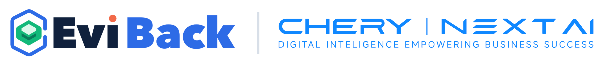
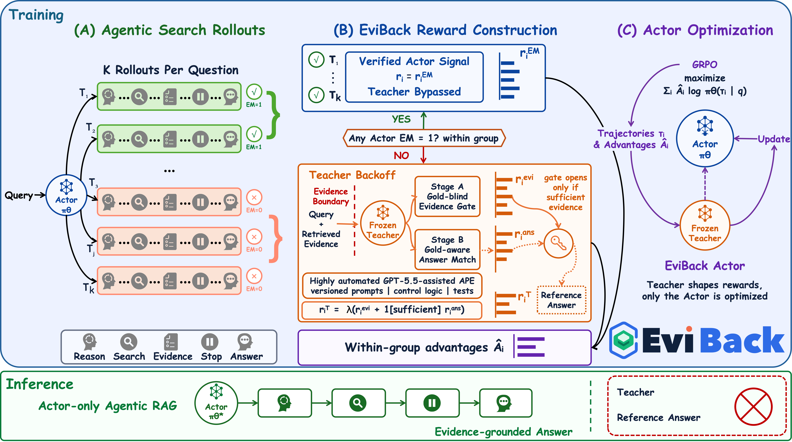

<p align="center">
  
</p>

<h1 align='center'>EviBack: Reinforcement Learning Search Agents via Evidence-Constrained Teacher Backoff</h1>

<div align='center'>
    <a href='https://github.com/chery-nextai' target='_blank'>Xiao Ma</a><sup>*</sup>&emsp;
    <a href='https://github.com/chery-nextai' target='_blank'>Zhiquan Hu</a><sup>*</sup>&emsp;
    <a href='https://github.com/chery-nextai' target='_blank'>Yi Wei</a>&emsp;
    <a href='https://github.com/chery-nextai' target='_blank'>Chenchen Zhao</a>&emsp;
    <a href='https://github.com/chery-nextai' target='_blank'>Yijun Chen</a>&emsp;
    <a href='https://github.com/chery-nextai' target='_blank'>Jicheng Zhao</a>&emsp;
    <a href='https://lymhust.github.io/' target='_blank'>Yuming Li</a><sup>i†</sup>&emsp;
    <a href='https://github.com/chery-nextai' target='_blank'>Chuang Dai</a>
</div>
<div align='center'>
NEXTAI Research Institute, Chery Group.
</div>
<p align='center'>
    <sup>*</sup>Equal Contribution, 
    <sup>i†</sup>Corresponding Author
</p>
<div align='center'>
    <a href='https://chery-nextai.github.io/eviback/'></a>
    <a href='https://arxiv.org/pdf/2607.23955'></a>
    <a href='https://huggingface.co/chery-nextai/eviback'></a>
    <a href='https://modelscope.cn/models/chery-nextai/eviback'></a>
    <a href='https://raw.githubusercontent.com/chery-nextai/chery-nextai.github.io/refs/heads/main/eviback/assets/wechat_group.png'></a>
</div>
<p align='center'> </p>

<p align="center">
  
</p>

<table align="center">
  <tr>
    <td align="center">
      
    </td>
  </tr>
  <tr>
    <td align="center">
      
    </td>
  </tr>
  <tr>
    <td align="center">
      
    </td>
  </tr>
</table>

## &#x1F4E3; Updates
* [2026.07.28] 🔥 Our [paper](https://arxiv.org/pdf/2607.23955) is in public on arxiv.

## 💡 Introduction
EviBack is a search-agent training framework with an Evidence-Constrained
Teacher. It keeps inference Actor-only and uses the Teacher as a fallback when
the Actor group receives no useful reward. The package provides the training,
retrieval, evaluation, and environment components needed to reproduce the method.
E2E-APE supplies the development-time prompt-engineering instructions used to
freeze the Teacher prompt. it is not used during Actor inference.

## 🔧 Install

Choose one accelerator profile before installing:

| Profile | Runtime | Environment and requirements | Device argument |
| --- | --- | --- | --- |
| GPU | NVIDIA CUDA 12.4 | `environment.yml`, `requirements-gpu.txt` | `cuda` |
| NPU | Ascend 910B + CANN | `environment-npu.yml`, `requirements-npu.txt` | `npu` |

The full installation procedures are [GPU installation](docs/install_gpu.md)
and [Ascend NPU installation](docs/install_npu.md). Do not install the CUDA
and NPU runtime profiles into the same environment.

The pure reward, parser, mock Teacher, evaluation, and data JSONL paths need no
GPU:

```bash
python -m venv .venv
. .venv/bin/activate
pip install -e '.[test,data]'
python -m pytest -q tests
python scripts/run_reward_smoke.py
```

For GPU formal training, use Python 3.11, a CUDA-compatible PyTorch build,
Transformers 4.57.6, vLLM 0.11.0, Ray, and a compatible VERL checkout. Apply
`third_party/verl/group_postnorm.patch` before training. For Ascend NPU formal
training, use the matched `torch-npu` and `vllm-ascend` stack described in
`docs/install_npu.md`. The complete historical environment is not yet
recovered; consult `release/environment_snapshot.txt`.

##  &#x1F331; Prepare data

Obtain each upstream QA dataset under its own terms and arrange it as described
in `datasets-examples/README.md`. Build the frozen 5,100/3,500 splits:

```bash
python scripts/prepare_data.py \
  --raw-root /path/to/raw-datasets \
  --output-root artifacts/data \
  --format parquet

python scripts/prepare_data.py \
  --check-only \
  --manifest datasets-examples/manifests/train_5100.json
```

Sampling is a stable SHA-256 order after normalized-question deduplication. The
manifests publish quotas, seeds, and the original derived-artifact hashes without
redistributing the data.

## &#x1F4C1; Services

Start a Search-R1-compatible dense retriever. Index, corpus, model, host, and
port are explicit parameters:

```bash
bash scripts/start_retriever.sh \
  --index /path/to/e5_Flat.index \
  --corpus /path/to/docs.jsonl \
  --model intfloat/e5-base-v2 \
  --device cuda \
  --port 8000
```

Use `--device cuda` for NVIDIA GPUs or `--device npu` for Ascend NPUs.

Serve the training Teacher through an OpenAI-compatible chat-completions API,
then export its endpoint and model. API credentials, when needed, are read from
`EVIBACK_TEACHER_API_KEY`.

```bash
export EVIBACK_RETRIEVER_ENDPOINT=http://127.0.0.1:8000/retrieve
export EVIBACK_TEACHER_ENDPOINT=http://127.0.0.1:8001/v1/chat/completions
export EVIBACK_TEACHER_MODEL=your-glm-4.7-flash-revision
```

## &#x1F4C8; Train

Start the formal VERL training job after installing VERL, applying the patch,
and preparing the datasets and services:

```bash
bash scripts/train_actor.sh \
  --config configs/training/qwen3_1.7b.yaml
```

The entry point supports `--model`, `--train-data`, `--eval-data`,
`--retriever-endpoint`, `--teacher-endpoint`, `--teacher-model`, `--output-dir`,
`--seed`, `--group-size`, and `--teacher-fallback-scale`. Unknown arguments are
forwarded as VERL/Hydra overrides.

The formal 1.7B configuration freezes 5,100 examples, 79 steps, eight rollouts,
and seed 42. Model-scale and lambda matrices are documented in
`configs/training/qwen3_scale_matrix.yaml`. Hardware-specific batch sizes remain
explicit user overrides because they depend on the available accelerator.

## &#x1F4CA; Evaluate

References are joined only after inference. The evaluator rejects duplicate or
misaligned `(data_source, index)` keys and mismatched question text.

|     Models     | Download Link HuggingFace | Download Link ModelScope |
|:--------------:|:-------------------------:|:------------------------:|
|   QWen3-0.6B   |   🤗 [HuggingFace]()      |   🔷 [ModelScope]()      |
|   QWen3-1.7B   |   🤗 [HuggingFace]()      |   🔷 [ModelScope]()      |
|    QWen3-4B    |   🤗 [HuggingFace]()      |   🔷 [ModelScope]()      |

```bash
bash scripts/run_evaluation.sh \
  --predictions artifacts/inference/evi_actor.jsonl \
  --references artifacts/data/eval_3500.jsonl \
  --output artifacts/evaluation/evi_actor.json \
  --model-checkpoint /path/to/actor-checkpoint \
  --retriever-revision your-index-revision
```

Reported metrics are legacy EM, token F1, valid-answer rate, mean search calls,
duplicate-query rate, maximum-turn rate, single-hop macro, multi-hop macro, and
paired bootstrap confidence intervals.

## &#x1F4CE; E2E-APE

E2E-APE is the project's development-time prompt-engineering process, not a
runtime component. The public artifacts are the English prompt in
`ape/controller_instructions.md`, the Chinese prompt in
`ape/controller_instructions_cn.md`, and the English contract in
`ape/contract_en.md`. They describe sample construction, labeling, prompt
ablation, evaluation, and strategy selection for an agent/model to carry out.
The generated runner, scorer, ablation, and selection code is intentionally not
included. `ape/prompts/frozen_policy.json` records the selected prompt
identifiers, while `ape/benchmark/` contains metadata and schema only; the raw
benchmark is not redistributed. See `ape/README.md`.

## 🗺️ Code map
```
.
├── src/
│   └── eviback/
│       ├── teacher/
│       │   └── Stage A, conditional Stage B, client, merge, provenance
│       ├── rewards/
│       │   └── Actor-first all-zero gate and paper reward
│       ├── training/
│       │   └── VERL adapter and post-normalization reference logic
│       ├── retrieval/
│       │   └── retriever client, optional server, public schema
│       ├── inference.py
│       │   └── iterative Actor-only search
│       ├── evaluation.py
│       │   └── aligned metrics and macro summaries
│       └── aggregate.py
│           └── paired bootstrap comparison
└── release/
    └── source freeze, environment, licenses, data decision, blockers
```

The current source candidate is designed to fail closed on malformed XML,
inconsistent group sizes/scales, missing identities, and evaluation misalignment.

## &#x1F4D2; Citation

If you find our work useful for your research, please consider citing the paper :

```
@article{ma2026eviback,
title={Search-Agent Reinforcement Learning via Evidence-Constrained Teacher Backoff},
  author={Xiao Ma, Zhiquan Hu, Yi Wei, Chenchen Zhao, Yijun Chen, Jicheng Zhao, Yuming Li, Chuang Dai},
  year={2026},
  eprint={2607.23955},
  archivePrefix={arXiv},
  primaryClass={cs.AI}
}
```

## 📜 License
The models in this repository are licensed under the Apache 2.0 License. We claim no rights over the your generated contents, 
granting you the freedom to use them while ensuring that your usage complies with the provisions of this license. 
You are fully accountable for your use of the models, which must not involve sharing any content that violates applicable laws, 
causes harm to individuals or groups, disseminates personal information intended for harm, spreads misinformation, or targets vulnerable populations. 

---
